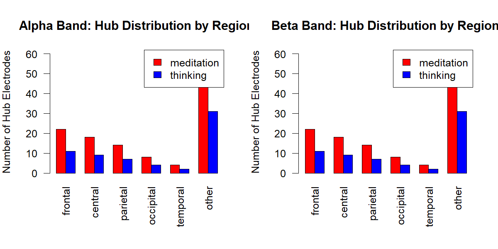
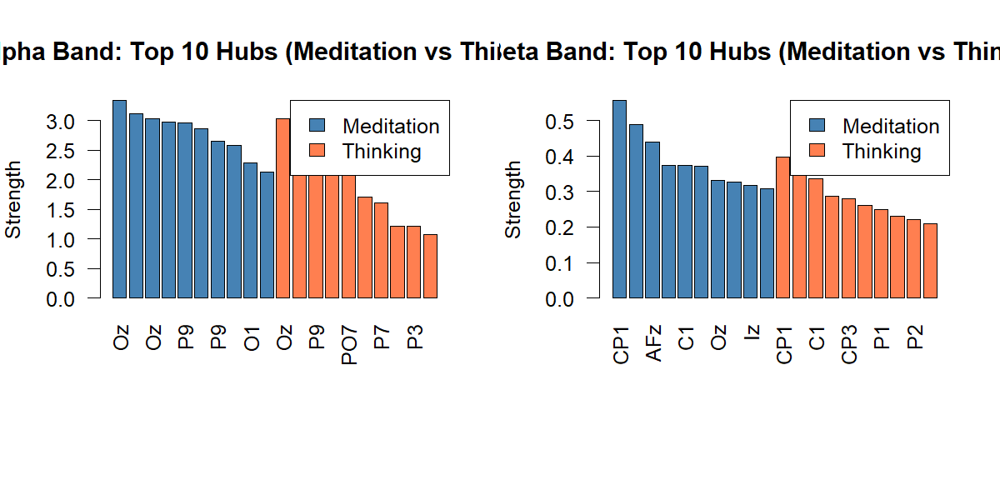

# Hub Electrode Analysis — Research Question 1

Generated from R analysis outputs in `src/results/hubs`.

Date: 2025-11-26

---

**Summary**

This report summarizes the hub electrode analysis comparing meditation and thinking states for Alpha and Beta frequency bands. The analysis used weighted Phase Lag Index (wPLI) connectivity matrices, thresholded at 15% density for hub identification. Centrality measures computed per electrode:

- Degree (unweighted)
- Strength (weighted)
- Betweenness (normalized)

Outputs used to create this report:

- `all_hub_metrics_15pct.csv` — complete electrode metrics for all conditions
- `region_summary.csv` — aggregated region-level statistics (avg_strength, avg_degree, avg_betweenness, hub_count)
- `top5_*.csv` — top 5 hub electrodes per condition (six files)
- PDF visualizations in `plots/`:
  - `top5_hubs_per_condition.pdf`
  - `hub_region_distribution.pdf`
  - `meditation_vs_thinking_strength.pdf`

---

## Methods (brief)

- Input: 64×64 wPLI average matrices per condition (alpha_med1, alpha_med2, alpha_thinking, beta_med1, beta_med2, beta_thinking).
- Thresholding: Proportional density thresholding kept the top 15% strongest edges for hub visualizations.
- Graph construction: `igraph::graph_from_adjacency_matrix` with weighted edges.
- Centrality: `degree`, `strength` (weights), and `betweenness` (normalized).
- Region mapping: electrodes mapped to `frontal`, `central`, `parietal`, `occipital`, `temporal`, or `other`.

---

## Key Findings (high level)

- Alpha band: Occipital electrodes (`Oz`, `Iz`, `O1`) consistently rank highest in strength across meditation and thinking, indicating posterior hubs in alpha.
- Beta band: Hub locations are more distributed, with central electrodes (e.g., `CP1`) and frontal electrodes (`AF3`, `AFz`) appearing among top hubs in meditation.
- Region-level aggregates show higher avg_strength in occipital regions for alpha, while beta med/think strengths are lower and more distributed across regions.

---

## Region Summary

The table below is taken from `region_summary.csv` and shows aggregated region metrics.

| band | state | region | avg_strength | avg_degree | avg_betweenness | hub_count |
|---:|---|---|---:|---:|---:|---:|
"alpha" | "meditation" | "occipital" | 2.30440672538112 | 30.875 | 0.0238095238095238 | 8
"alpha" | "meditation" | "other" | 0.614549744282328 | 8.90322580645161 | 0.00871281568471995 | 62
"alpha" | "meditation" | "frontal" | 0.597152857793934 | 8.59090909090909 | 0.0017921146953405 | 22
"alpha" | "meditation" | "parietal" | 0.490776038134503 | 7.42857142857143 | 0.0116670324043596 | 14
"alpha" | "meditation" | "central" | 0.433400534151812 | 6.22222222222222 | 0.00719690504636741 | 18
"alpha" | "meditation" | "temporal" | 0.0611147035650688 | 1 | 0.000128008192524322 | 4
"alpha" | "thinking" | "occipital" | 2.12938650232926 | 29 | 0.0224014336917563 | 4
"alpha" | "thinking" | "other" | 0.628093648631312 | 9.35483870967742 | 0.00862197116099301 | 31
"alpha" | "thinking" | "frontal" | 0.554766056844006 | 8.18181818181818 | 0.00102406554019457 | 11
"alpha" | "thinking" | "parietal" | 0.499256138526333 | 7.71428571428571 | 0.0154341306415039 | 7
"alpha" | "thinking" | "central" | 0.408395627174962 | 6 | 0.00529100529100529 | 9
"alpha" | "thinking" | "temporal" | 0 | 0 | 0 | 2
"beta" | "meditation" | "occipital" | 0.223037831431726 | 18.375 | 0.0347542242703533 | 8
"beta" | "meditation" | "central" | 0.138302298555419 | 10.7222222222222 | 0.00935882118677818 | 18
"beta" | "meditation" | "other" | 0.119809518765961 | 9.64516129032258 | 0.0133871793601242 | 62
"beta" | "meditation" | "frontal" | 0.11145361013943 | 8.77272727272727 | 0.00391006842619746 | 22
"beta" | "meditation" | "parietal" | 0.0604109804617096 | 5.28571428571429 | 0.0138248847926267 | 14
"beta" | "meditation" | "temporal" | 0.00975809071616348 | 0.75 | 0.00678443420378904 | 4
"beta" | "thinking" | "occipital" | 0.150114081473091 | 15.25 | 0.0266257040450589 | 4
"beta" | "thinking" | "central" | 0.138935680107196 | 13.1111111111111 | 0.0125163566023781 | 9
"beta" | "thinking" | "other" | 0.0956141838659061 | 9.41935483870968 | 0.0139405050955519 | 31
"beta" | "thinking" | "parietal" | 0.0813209130329074 | 8.42857142857143 | 0.0264062614293029 | 7
"beta" | "thinking" | "frontal" | 0.0636815313947746 | 6.45454545454545 | 0.00242051854955081 | 11
"beta" | "thinking" | "temporal" | 0.0136000758959598 | 1.5 | 0.00153609831029186 | 2

---

## Top 5 hubs (per condition)

### Alpha — Meditation 1 (top5)

| electrode | degree | strength | betweenness | region |
|---|---:|---:|---:|---|
| Oz | 41 | 3.3521428910231 | 0.00460829493087558 | occipital |
| Iz | 40 | 3.11682696834077 | 0.03584229390681 | occipital |
| O1 | 40 | 2.97302285722914 | 0.0307219662058372 | occipital |
| P9 | 39 | 2.96492096294715 | 0.0281618023553507 | other |
| PO7 | 37 | 2.58093707632238 | 0.0701484895033282 | parietal |

### Alpha — Meditation 2 (top5)

| electrode | degree | strength | betweenness | region |
|---|---:|---:|---:|---|
| Oz | 40 | 3.03654828819134 | 0.0614439324116743 | occipital |
| Iz | 39 | 2.86419111048324 | 0.0225294418842806 | occipital |
| P9 | 38 | 2.66028320574303 | 0.0552995391705069 | other |
| O1 | 34 | 2.28387014527826 | 0.0220174091141833 | occipital |
| PO7 | 31 | 1.99397244805819 | 0.0399385560675883 | parietal |

### Alpha — Thinking (top5)

| electrode | degree | strength | betweenness | region |
|---|---:|---:|---:|---|
| Oz | 39 | 3.04096920551876 | 0.0291858678955453 | occipital |
| Iz | 40 | 2.93393948735249 | 0.0522273425499232 | occipital |
| P9 | 36 | 2.52606207169107 | 0.039426523297491 | other |
| O1 | 34 | 2.35385724837506 | 0.00768049155145929 | occipital |
| PO7 | 33 | 2.15348933809814 | 0.0993343573988735 | parietal |

### Beta — Meditation 1 (top5)

| electrode | degree | strength | betweenness | region |
|---|---:|---:|---:|---|
| CP1 | 32 | 0.372669680277153 | 0.0117767537122376 | central |
| Oz | 35 | 0.371024891224391 | 0.0778289810547875 | occipital |
| C1 | 29 | 0.327606054779117 | 0.0517153097798259 | other |
| POz | 30 | 0.308856910068195 | 0.0896057347670251 | other |
| Iz | 27 | 0.287692179700735 | 0.0506912442396313 | occipital |

### Beta — Meditation 2 (top5)

| electrode | degree | strength | betweenness | region |
|---|---:|---:|---:|---|
| CP1 | 35 | 0.558070182957977 | 0.0737327188940092 | central |
| AF3 | 31 | 0.488417064327148 | 0.0337941628264209 | frontal |
| AFz | 28 | 0.439279176032179 | 0.0302099334357399 | other |
| C1 | 24 | 0.372556044875896 | 0.0424987199180748 | other |
| Oz | 23 | 0.332589474188116 | 0.0302099334357399 | occipital |

### Beta — Thinking (top5)

| electrode | degree | strength | betweenness | region |
|---|---:|---:|---:|---|
| CP1 | 35 | 0.397289945729155 | 0.0660522273425499 | central |
| POz | 37 | 0.389676767786944 | 0.103942652329749 | other |
| C1 | 30 | 0.335718022136297 | 0.0809011776753712 | other |
| Oz | 29 | 0.287535722749576 | 0.0721966205837174 | occipital |
| CP3 | 26 | 0.279026854420291 | 0.0102406554019457 | central |

---

## Visualizations

Included visualizations (embedded PNGs regenerated from CSVs):

> Note: The plotted figures are embedded as PNGs so the Markdown can be converted directly to a single PDF using Pandoc+LaTeX or another Markdown renderer. If you prefer to use the original PDFs, they remain in `plots/` as well.

---

## Notes & Next Steps

- I included the full `region_summary` table and the six top-5 tables above. If you'd like the full `all_hub_metrics_15pct.csv` table embedded as a collapsible / downloadable file, I can append that.
- I can also attempt to automatically convert the Markdown to PDF here if you want; I will check for `pandoc` and `pdftoppm` availability and try to produce `hub_report.pdf` and `hub_report_combined.pdf`.

